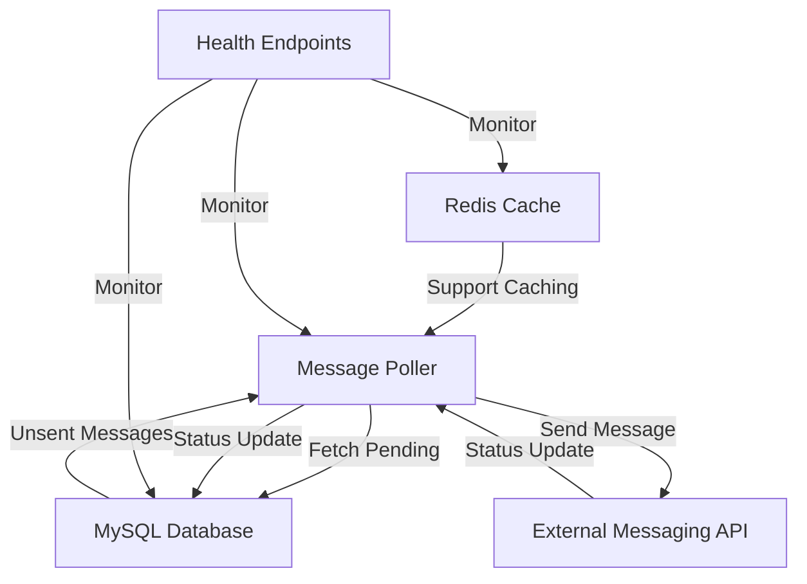

# Auto Message Dispatcher

An automated messaging service that fetches and dispatches unsent messages from a database at regular intervals using predefined API endpoints. Built with Go, this system provides reliable message delivery with status tracking and monitoring capabilities.

## Architecture Overview



## Prerequisites

- Docker and Docker Compose
- Go 1.23.1 (for local development)
- MySQL 8.0
- Redis 7

## API Documentation
https://smitendu1997.github.io/auto-message-dispatcher/

## Quick Start

1. Clone the repository:
```bash
git clone https://github.com/smitendu1997/auto-message-dispatcher.git
cd auto-message-dispatcher
```
2. Open https://webhook.site/
   Step 1:
    configure the response to:
    ```
        {
        "message": "Accepted",
        "messageId": "67f2f8a8-ea58-4ed0-a6f9-ff217df4d849"
        }
    ```
    configure response code to: 202

   Step 2:
    copy the URL and update it in MESSAGING_API_BASE_URL in .env file located in auto-message-dispatcher/config/.env

2. Configure environment variables:
```bash
cp config/.env.example config/.env
# Edit .env file with your configurations
```

3. Start the services:
```bash
./deploy-server.sh
```


## Configuration

Configuration is managed through environment variables in the `.env` file:

### Database Configuration
- `MYSQL_DB_USERNAME`: Database username
- `MYSQL_DB_PASSWORD`: Database password
- `MYSQL_DB_HOST`: Database host
- `MYSQL_DB_PORT`: Database port
- `MYSQL_DB_SCHEMA`: Database schema name

### Redis Configuration
- `REDIS_HOST`: Redis host
- `REDIS_PORT`: Redis port
- `REDIS_USERNAME`: Redis username (optional)
- `REDIS_PASSWORD`: Redis password (optional)
- `REDIS_DB`: Redis database number

### Messaging API Configuration
- `MESSAGING_API_BASE_URL`: Base URL for the messaging service
- `MESSAGING_API_KEY`: API key for authentication
- `MESSAGING_API_PORT`: Port for the messaging service
- `API_USER_CURRENT`: Current API user hash (username:password SHA256)
- `API_USER_PREVIOUS`: Previous API user hash (username:password SHA256)

### Logging Configuration
- `APICallLogs`: To Print the API Call Logs
- `SQL_DEBUG`: To Print the SQL query and connection logs
- `LOG_LEVEL`: To set the log level

## Database Schema

Messages are stored in the `messages` table with the following structure:

```sql
CREATE TABLE `messages` (
  `id` bigint NOT NULL AUTO_INCREMENT,
  `recipient_phone` VARCHAR(20) NOT NULL COMMENT 'receipent phone number',
  `content` varchar(200) NOT NULL COMMENT 'message content',
  `status` ENUM('pending', 'failed', 'sent') NOT NULL DEFAULT 'pending',
  `messageId` VARCHAR(100) DEFAULT NULL COMMENT 'message ID from the messaging service',
  `sent_at` datetime DEFAULT NULL COMMENT 'when the message was sent',
  `retry_count` int NOT NULL DEFAULT 0 COMMENT 'number of retry attempts',
  `createdOn` datetime DEFAULT CURRENT_TIMESTAMP COMMENT 'Record creation timestamp',
  `updatedOn` datetime DEFAULT CURRENT_TIMESTAMP ON UPDATE CURRENT_TIMESTAMP COMMENT 'Record last updated timestamp',
  PRIMARY KEY (`id`),
  KEY `idx_messages_status` (`status`),
  KEY `idx_messages_recipient_phone` (`recipient_phone`)
) ;
```

## Health Monitoring

The service provides a health endpoint at `/health` that monitors:
- Application status
- MySQL connection status
- Redis connection status

Response format:
```json
{
    "status": "up|degraded",
    "mysql": "up|down",
    "redis": "up|down"
}
```

## Development

1. Install dependencies:
```bash
go mod download
```

2. Start required services:
```bash
docker-compose up -d mysql redis
```

3. Start the service locally:
```bash
go run cmd/messaging/main.go
```

## Security

- API authentication using API keys
- Secure password hashing for API users
- CORS configuration for web security

## Docker Deployment

The service includes three main components in Docker:

1. MySQL Database:
   - Image: mysql:8.0
   - Persistent volume for data storage
   - Initialized with required schema

2. Redis Cache:
   - Image: redis:7-alpine
   - Persistent volume for data
   - Health monitoring configured

3. Message Dispatcher Service:
   - Custom built from Dockerfile
   - Depends on MySQL and Redis
   - Configurable through environment variables
   - Health monitoring enabled

To deploy using Docker:
```bash
./deploy-server.sh
```

## Support

For support and questions, please open an issue in the GitHub repository.
